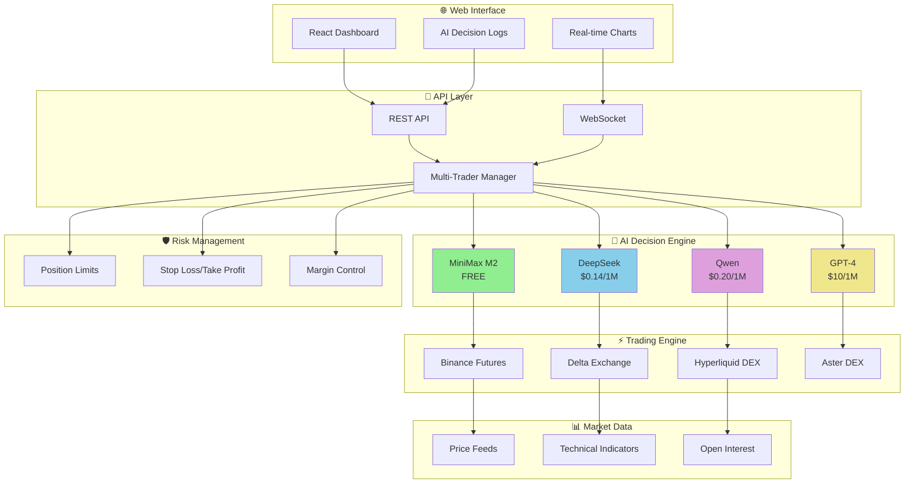

# 🤖 DANTO - Universal Agentic Trading OS

<div align="center">

[](https://golang.org/)
[](https://reactjs.org/)
[](https://www.typescriptlang.org/)
[](LICENSE)

[](#-ai-providers)
[](#-supported-exchanges)
[](https://amber.ac)

**The world's first universal AI trading operating system with self-learning capabilities**

[🚀 Quick Start](#-quick-start) • [📖 Documentation](INTEGRATION_GUIDE.md) • [💬 Community](https://t.me/nofx_dev_community) • [🐦 Twitter](https://x.com/nofx_ai)

</div>

---

## 🎯 What is DANTO?

DANTO revolutionizes algorithmic trading through **AI agents that learn, compete, and evolve**. Our closed-loop system enables multiple AI models to trade across exchanges while continuously improving their strategies based on real performance data.

### ⚡ Quick Start (3 Minutes)

```bash
# 1. Clone & Setup
git clone https://github.com/somdipto/DANTO.git && cd DANTO

# 2. Configure (add your API keys)
cp config.json.example config.json && nano config.json

# 3. Start with Docker
./start.sh start --build

# 4. Access Dashboard
open http://localhost:3000
```

---

## 🏗️ System Architecture



---

## 🤖 AI Providers

| Provider | Cost | Speed | Quality | Free Tier | Best For |
|----------|------|-------|---------|-----------|----------|
| **🆓 MiniMax M2** | **FREE** | ⚡ Fast | ⭐⭐⭐⭐ | ✅ Unlimited | **Beginners** |
| **💎 DeepSeek** | $0.14/1M | ⚡ Fast | ⭐⭐⭐⭐⭐ | ❌ | **Performance** |
| **🔥 Qwen** | $0.20/1M | 🔄 Medium | ⭐⭐⭐⭐ | ❌ | **Reliability** |
| **🚀 GPT-4** | $10/1M | 🔄 Medium | ⭐⭐⭐⭐⭐ | ❌ | **Maximum Quality** |

---

## 🏦 Supported Exchanges

<div align="center">

| Exchange | Type | Leverage | Features |
|----------|------|----------|----------|
| **🟡 Binance** | CEX | 125x | Highest liquidity, 200+ pairs |
| **🟠 Delta** | CEX | 100x | Advanced derivatives, options |
| **🔵 Hyperliquid** | DEX | 50x | No KYC, on-chain settlement |
| **🟢 Aster** | DEX | 20x | Multi-chain, API wallet security |

</div>

---

## 🏆 Key Features

<div align="center">

### 🧠 **Multi-Agent Competition**
AI models compete in real-time, learning from wins and losses

### 📊 **Professional Interface**
Binance-style dashboard with real-time charts and analytics

### ⚡ **Advanced Risk Management**
AI-driven position sizing with multi-layer protection

### 🔄 **Self-Learning System**
Historical analysis and strategy adaptation

</div>

---

## 📝 Configuration Examples

### Beginner Setup (Free AI)
```json
{
  "traders": [{
    "id": "my_trader",
    "ai_model": "minimax",
    "exchange": "binance",
    "minimax_key": "your_free_key",
    "binance_api_key": "your_binance_key",
    "binance_secret_key": "your_binance_secret",
    "initial_balance": 1000
  }]
}
```

### Multi-Agent Competition
```json
{
  "traders": [
    {
      "id": "deepseek_binance",
      "ai_model": "deepseek",
      "exchange": "binance"
    },
    {
      "id": "minimax_delta",
      "ai_model": "minimax", 
      "exchange": "delta"
    }
  ]
}
```

---

## 🚀 Getting Started

### Prerequisites
- **Trading Account**: [Binance](https://www.binance.com/join?ref=TINKLEVIP) | [Delta Exchange](https://www.delta.exchange) | [Hyperliquid](https://hyperliquid.xyz) | [Aster DEX](https://www.asterdex.com)
- **AI API Key**: [MiniMax (FREE)](https://api.minimax.io) | [DeepSeek](https://platform.deepseek.com) | [Qwen](https://dashscope.aliyuncs.com)

### Installation

#### 🐳 Docker (Recommended)
```bash
git clone https://github.com/somdipto/DANTO.git && cd DANTO
cp config.json.example config.json
# Edit config.json with your API keys
./start.sh start --build
```

#### ⚙️ Manual Setup
<details>
<summary>Click to expand manual installation</summary>

**Requirements:** Go 1.21+, Node.js 18+, TA-Lib

```bash
# Install TA-Lib
brew install ta-lib  # macOS
sudo apt-get install libta-lib0-dev  # Ubuntu

# Setup
go mod download
cd web && npm install && cd ..
cp config.json.example config.json
# Edit config.json
go build -o danto && ./danto
```
</details>

---

## 📸 Screenshots

<div align="center">

### 🏆 Competition Dashboard

*Real-time AI battle with performance leaderboards*

### 📊 Trading Interface  

*Professional dashboard with equity curves and decision logs*

</div>

---

## 🆕 Latest Updates

### 🚀 **MiniMax M2 Integration** - Completely FREE AI!
- ✅ Zero API costs - Perfect for beginners
- ✅ Anthropic Claude compatibility
- ✅ No rate limits - Trade as much as you want

### 🟠 **Delta Exchange Support** - Advanced Derivatives
- ✅ Options, futures, perpetuals
- ✅ Up to 100x leverage
- ✅ Global access with competitive fees

---

## 🏢 Team & Backing

<div align="center">

**Backed by [Amber.ac](https://amber.ac)**

**Core Team:**
- **Tinkle** - [@Web3Tinkle](https://x.com/Web3Tinkle) - CEO & Co-founder
- **Zack** - [@0x_ZackH](https://x.com/0x_ZackH) - CTO & Co-founder

**🚀 Seed Round Open** - Building the future of AI trading

</div>

---

## 🌐 Community & Support

<div align="center">

[](https://t.me/nofx_dev_community)
[](https://x.com/nofx_ai)
[](INTEGRATION_GUIDE.md)
[](https://github.com/somdipto/DANTO/issues)

</div>

---

## ⚠️ Risk Warning

> **AI trading involves significant risk. Only use funds you can afford to lose. Start with small amounts for testing. Past performance doesn't guarantee future results.**

---

## 📄 License

MIT License - See [LICENSE](LICENSE) file for details.

---

<div align="center">

**⭐ Star this repo if you find it useful!**

Made with ❤️ by the DANTO team

</div>
